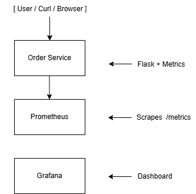
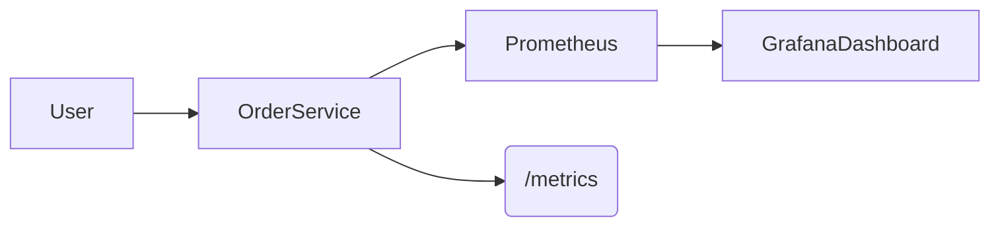
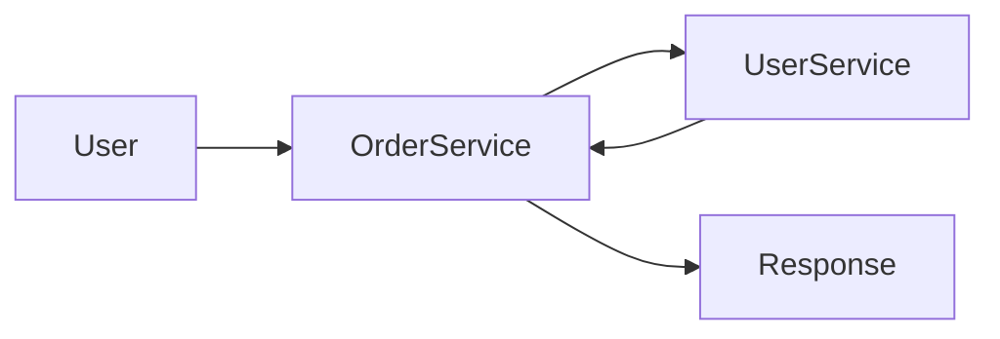
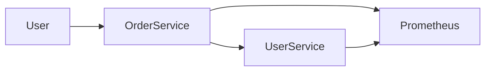

# Cloud-Native Observability Platform
A production-style observability system built using Python micrroservices, Prometheus, and Grafana to monitor real-time application metrics.

Key Features
Real-time monitoring using Prometheus
Interactive dashboards with Grafana
Custom metrics instrumentation in Python
Contenarized using Docker & Docker Compose
API-based traffic simulation for live metrics
Production-like architecture (service-to-service observability)

## Architecture



## Tech STack
Python (Flask)
Prometheus
Grafana
Docker & Docker Compose
REST APIs

## metrics Tracked
prder_requests_total
user_requests_total
Request rate (rate() in Prometheus)
API traffic patterns

## How to Run
1. Clone Repo
    git clone <repo-url>
    cd <repo-name>

2. Start Services
    docker-compose up --build

3. Access Applications
    User Service --> http://localhost:8000
    Order Service --> http://localhost:8001
    Prometheus --> http://localhost:9090
    Grafana --> http://localhost:3000

## Grafana Dashboard
Create Dashboard
Add query:
    rate(order_requests_total[1m])

Generate Traffic:
    curl http://localhost:8001/orders

## Learnings
--> Service discovery in Docker vs local environment
--> Prometheus scraping & metrics lifecycle
--> Debugging real-world monitoring issues
--> Observability design patterns

## Future Enhancements
Add alerting (Grafana Alerts)
Integrate OpenTelemetry (OTel)
Deploy on AWS (ECS/EKS)
Add logs (ELK stack)

# Author
Ajit Pandey


# sre-observability-platform
Production-grade Python microservices platform with observability, SLOs, and failure simulation for SRE practices

Multi-service architecture with Inter-service communication



Microservices; service-to-service calls with Distributed tracing and Metrics collection




Final Architecture Flowchart - Microservices with Distributed tracing and Metrics collection - Monitoring through Prometheus and Visualization through Grafana

```mermaid
flowchart LR
    User --> Grafana
    Grafana --> Prometheus
    Prometheus --> OrderService
    Prometheus --> UserService
    OrderService --> UserService