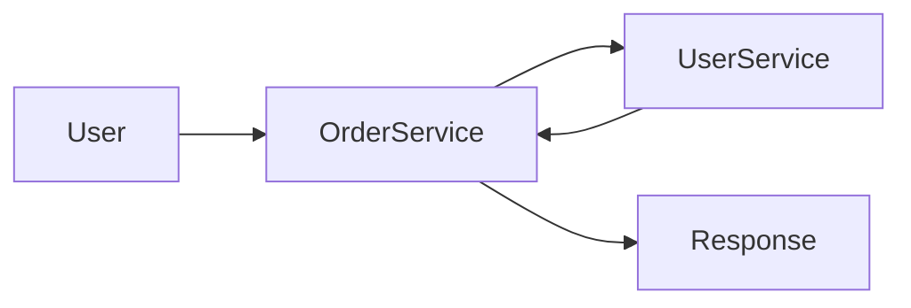
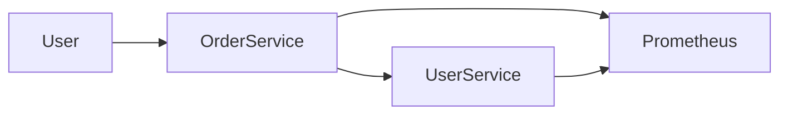

# sre-observability-platform
Production-grade Python microservices platform with observability, SLOs, and failure simulation for SRE practices

Multi-service architecture with Inter-service communication



Microservices; service-to-service calls with Distributed tracing and Metrics collection




Final Architecture Flowchart - Microservices with Distributed tracing and Metrics collection - Monitoring through Prometheus and Visualization through Grafana

```mermaid
flowchart LR
    User --> Grafana
    Grafana --> Prometheus
    Prometheus --> OrderService
    Prometheus --> UserService
    OrderService --> UserService